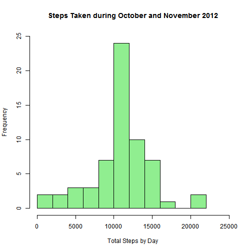

Data Analysis on Daily Activity
===============================  

## Introduction
This report uses data collected from a personal activity monitoring device. The data was collected at 5 minute intervals throughout the days during the months of October and November 2012.  

#### First of all, load needed libraries here and set R-markdown global variables (set both echo and results to TRUE)

```r
suppressWarnings(suppressPackageStartupMessages(library(lattice)))
suppressWarnings(suppressPackageStartupMessages(library(dplyr)))
```

## Part 1. Loading and preprocessing the data
#### Step1. Unzip activity.zip and load data into R using read.csv
#### Step2. Convert "date" column from character to Date data type


```r
mydata <- read.csv(unzip("activity.zip"), sep=",",
	as.is=TRUE, stringsAsFactor=FALSE)
	
mydata$date <- as.Date(mydata$date, "%Y-%m-%d")
str(mydata)
```

```
## 'data.frame':	17568 obs. of  3 variables:
##  $ steps   : int  NA NA NA NA NA NA NA NA NA NA ...
##  $ date    : Date, format: "2012-10-01" "2012-10-01" ...
##  $ interval: int  0 5 10 15 20 25 30 35 40 45 ...
```

```r
tbl_df(mydata)
```

```
## Source: local data frame [17,568 x 3]
## 
##    steps       date interval
## 1     NA 2012-10-01        0
## 2     NA 2012-10-01        5
## 3     NA 2012-10-01       10
## 4     NA 2012-10-01       15
## 5     NA 2012-10-01       20
## 6     NA 2012-10-01       25
## 7     NA 2012-10-01       30
## 8     NA 2012-10-01       35
## 9     NA 2012-10-01       40
## 10    NA 2012-10-01       45
## ..   ...        ...      ...
```

## Part 2. What is mean total number of steps taken per day?
##### For this part of the assignment, missing values in the dataset are ignored.


#### Step1. Calculate the total number of steps taken per day

```r
by_date <- group_by(mydata, date)
# Get total number of steps per day
StepsEachDay <- summarize(by_date, TotalStep=sum(steps, na.rm=TRUE))
tbl_df(StepsEachDay)
```

```
## Source: local data frame [61 x 2]
## 
##          date TotalStep
## 1  2012-10-01         0
## 2  2012-10-02       126
## 3  2012-10-03     11352
## 4  2012-10-04     12116
## 5  2012-10-05     13294
## 6  2012-10-06     15420
## 7  2012-10-07     11015
## 8  2012-10-08         0
## 9  2012-10-09     12811
## 10 2012-10-10      9900
## ..        ...       ...
```

#### Step2. Research the difference between a histogram and a barplot  
    Difference between a barplot and a histogram:  
    1.  Histograms are used to show distributions of variables while
              bar charts are used to compare variables.  
    2.  Histograms plot quantitative data with ranges of the data grouped into
              bins or intervals while bar charts plot categorical data.  
              
#### Step3. Make a histogram of the total number of steps taken each day

```r
hist(x=StepsEachDay$TotalStep, breaks=15, col="lightblue",
     xlab="Total Steps by Day",
     main="Steps Taken per Day During October and November 2012",
     ylim=c(0,20), xlim=c(0,25000))
```

 

#### Step4. Calculate and report the mean and median of the total number of steps taken per day


```r
dailyMean <- mean(StepsEachDay$TotalStep, na.rm=TRUE)
paste("mean of the total number of steps per day is ", dailyMean)
```

```
## [1] "mean of the total number of steps per day is  9354.22950819672"
```

```r
dailyMedian <- median(StepsEachDay$TotalStep, na.rm=TRUE)
paste("median of the total number of steps per day is ", dailyMedian)
```

```
## [1] "median of the total number of steps per day is  10395"
```

## Part 3. What is the average daily activity pattern?

#### Step1. Make a time series plot with the 5-minute intervals on the x-axis and the average number of steps taken on the y-axis averaged across all days

```r
by_interval <- group_by(mydata, interval)
Mean_by_Interval <- summarize(by_interval, AvgSteps=mean(steps, na.rm=TRUE))
tbl_df(Mean_by_Interval)
```

```
## Source: local data frame [288 x 2]
## 
##    interval  AvgSteps
## 1         0 1.7169811
## 2         5 0.3396226
## 3        10 0.1320755
## 4        15 0.1509434
## 5        20 0.0754717
## 6        25 2.0943396
## 7        30 0.5283019
## 8        35 0.8679245
## 9        40 0.0000000
## 10       45 1.4716981
## ..      ...       ...
```

```r
plot(x=Mean_by_Interval$interval, y=Mean_by_Interval$AvgSteps, type="l",
     main = "Average Number of Steps In 5-minute Interval Throughout A Day",
     xlab = "5-minute Time Interval",
     ylab = "Average Number of Steps",
     col = "red")
```

 

#### Step2. Find the maximum number of steps taken is in which 5-minute interval on average across all the days in the dataset

```r
maxInterval <- Mean_by_Interval[max(Mean_by_Interval$AvgSteps)==Mean_by_Interval$AvgSteps,][1]
paste("The maximum number of steps take is in the interval: ", maxInterval$interval)
```

```
## [1] "The maximum number of steps take is in the interval:  835"
```

## Part 4. Imputing missing values
#### Step1. Calculate and report the total number of missing values in the dataset

```r
paste("There are ", count(filter(mydata, is.na(steps)))$n, "observations that have missing values.")
```

```
## [1] "There are  2304 observations that have missing values."
```

#### Setp2. Devise a strategy for filling in all of the missing values in the dataset.

```r
NAcounts <- summarize(by_date, NAcounts=sum(is.na(steps)))
missingDays <- NAcounts[which(NAcounts$NAcounts > 0),]
tbl_df(missingDays)
```

```
## Source: local data frame [8 x 2]
## 
##         date NAcounts
## 1 2012-10-01      288
## 2 2012-10-08      288
## 3 2012-11-01      288
## 4 2012-11-04      288
## 5 2012-11-09      288
## 6 2012-11-10      288
## 7 2012-11-14      288
## 8 2012-11-30      288
```
##### Strategy for filling in all of the missing values in the dataset:  
- Findings: There are a total number of 8 days that have missing values throughout the days  
- Strategy: Use the mean for each 5-minute interval to fill the days with missing values  

#### Step3. Create a new dataset with the missing data filled in

```r
filledmyData <- mydata
for (i in NAcounts[which(NAcounts$NAcounts > 0),]$date){
        filledmyData$steps[which(filledmyData$date == i)] <- Mean_by_Interval$AvgSteps
}
tbl_df(filledmyData)
```

```
## Source: local data frame [17,568 x 3]
## 
##        steps       date interval
## 1  1.7169811 2012-10-01        0
## 2  0.3396226 2012-10-01        5
## 3  0.1320755 2012-10-01       10
## 4  0.1509434 2012-10-01       15
## 5  0.0754717 2012-10-01       20
## 6  2.0943396 2012-10-01       25
## 7  0.5283019 2012-10-01       30
## 8  0.8679245 2012-10-01       35
## 9  0.0000000 2012-10-01       40
## 10 1.4716981 2012-10-01       45
## ..       ...        ...      ...
```

#### Step4. Make a histogram of the total number of steps taken each day with the missing-value-filled dataset 

```r
by_date_filled <- group_by(filledmyData, date)
StepsEachDay_filled <- summarize(by_date_filled, TotalStep=sum(steps, na.rm=TRUE))
tbl_df(StepsEachDay_filled)
```

```
## Source: local data frame [61 x 2]
## 
##          date TotalStep
## 1  2012-10-01  10766.19
## 2  2012-10-02    126.00
## 3  2012-10-03  11352.00
## 4  2012-10-04  12116.00
## 5  2012-10-05  13294.00
## 6  2012-10-06  15420.00
## 7  2012-10-07  11015.00
## 8  2012-10-08  10766.19
## 9  2012-10-09  12811.00
## 10 2012-10-10   9900.00
## ..        ...       ...
```

```r
hist(x=StepsEachDay_filled$TotalStep, col="lightgreen", breaks = 15,
     xlab="Total Steps by Day",
     main="Steps Taken during October and November 2012",
     ylim=c(0,25), xlim=c(0,25000))
```

 

#### Step5. Calculate and report the mean and median of the total number of steps taken per day

```r
dailyMean_filled <- mean(StepsEachDay_filled$TotalStep, na.rm=TRUE)
paste("mean of the total number of steps with missing-value-filled dataset is ", dailyMean_filled)
```

```
## [1] "mean of the total number of steps with missing-value-filled dataset is  10766.1886792453"
```

```r
dailyMedian_filled <- median(StepsEachDay_filled$TotalStep, na.rm=TRUE)
paste("median of the total number of steps with missing-value-filled dataset is ", dailyMedian_filled)
```

```
## [1] "median of the total number of steps with missing-value-filled dataset is  10766.1886792453"
```


#### Step6. Find out how these values differ from the estimates from the 1st part of the assignment, and what is the imputing missing data on the estimates of the total daily number of steps  
With the missing data filled with the average number of steps per interval on those missing days, the mean and median are both equal to 1.0766189 &times; 10<sup>4</sup>. Before filling in, the median was 10395 and was slightly lower because the steps in those missing dates are basically zeros.  In the histogram, we can see that the 1st bin in the first histogram is not on the second histogram for the same reason.  

Filling in the missing data makes the diagram do not imply there are some out-liners. 

## Part 5. Are there differences in activity patterns between weekdays and weekends?

#### Step1. Create a factor with two levels: "weekday" and "weekend"

```r
filledmyData <- mutate(filledmyData, day=weekdays(filledmyData$date))
for (i in seq_along(filledmyData$day)){
        if (filledmyData$day[i] %in% c("Saturday","Sunday")){
                filledmyData$wday[i] <-  "weekend"
        } else {
                filledmyData$wday[i] <-  "weekday"
        }
}
filledmyData <- transform(filledmyData, wday = factor(wday))
str(filledmyData)
```

```
## 'data.frame':	17568 obs. of  5 variables:
##  $ steps   : num  1.717 0.3396 0.1321 0.1509 0.0755 ...
##  $ date    : Date, format: "2012-10-01" "2012-10-01" ...
##  $ interval: int  0 5 10 15 20 25 30 35 40 45 ...
##  $ day     : chr  "Monday" "Monday" "Monday" "Monday" ...
##  $ wday    : Factor w/ 2 levels "weekday","weekend": 1 1 1 1 1 1 1 1 1 1 ...
```

```r
tbl_df(filledmyData)
```

```
## Source: local data frame [17,568 x 5]
## 
##        steps       date interval    day    wday
## 1  1.7169811 2012-10-01        0 Monday weekday
## 2  0.3396226 2012-10-01        5 Monday weekday
## 3  0.1320755 2012-10-01       10 Monday weekday
## 4  0.1509434 2012-10-01       15 Monday weekday
## 5  0.0754717 2012-10-01       20 Monday weekday
## 6  2.0943396 2012-10-01       25 Monday weekday
## 7  0.5283019 2012-10-01       30 Monday weekday
## 8  0.8679245 2012-10-01       35 Monday weekday
## 9  0.0000000 2012-10-01       40 Monday weekday
## 10 1.4716981 2012-10-01       45 Monday weekday
## ..       ...        ...      ...    ...     ...
```

#### Setp2. Make a time series panel plot with the 5-minute interval on x-axis and the number of steps taken on the y-axis that are averaged across weekdays and weekends

```r
by_interval_wday <- group_by(filledmyData, wday, interval)
Mean_by_Interval_wday <- summarize(by_interval_wday,
                                   AvgSteps=mean(steps, na.rm=TRUE))

tbl_df(Mean_by_Interval_wday)
```

```
## Source: local data frame [576 x 3]
## 
##       wday interval   AvgSteps
## 1  weekday        0 2.25115304
## 2  weekday        5 0.44528302
## 3  weekday       10 0.17316562
## 4  weekday       15 0.19790356
## 5  weekday       20 0.09895178
## 6  weekday       25 1.59035639
## 7  weekday       30 0.69266247
## 8  weekday       35 1.13794549
## 9  weekday       40 0.00000000
## 10 weekday       45 1.79622642
## ..     ...      ...        ...
```

```r
xyplot(AvgSteps ~ interval | wday, data=Mean_by_Interval_wday,
       type="l", layout = c(1,2),
       xlab="5-minute Interval Throughout a Day",
       ylab="Average Number of Steps",
       main="Average Number of Steps across Weekends and Weekdays")
```

 

#### Difference in activity patterns between weekdays and weekends:  
- In general, there are more activities during the day on weekends than on weekdays.  
- There are less activities on weekdays throughout the day except for the time intervals between 910 and 930.    


